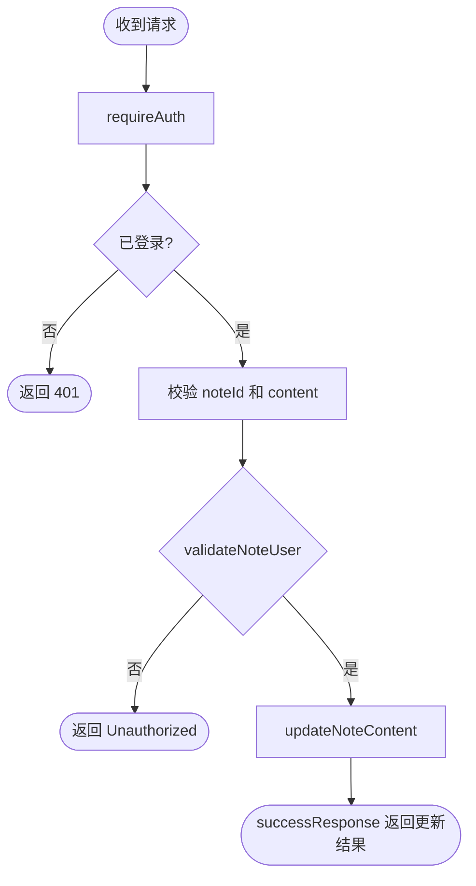
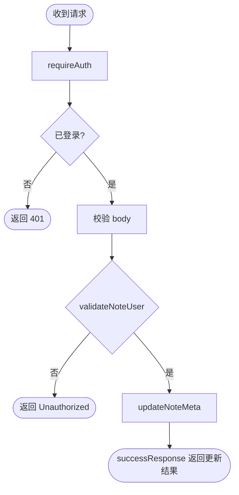
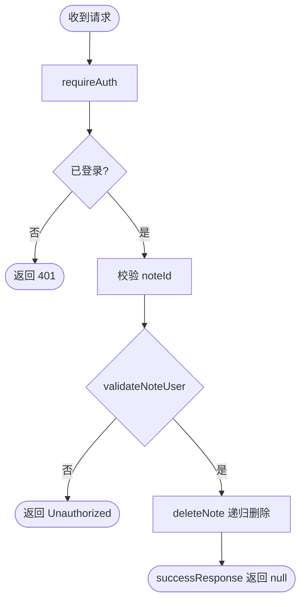
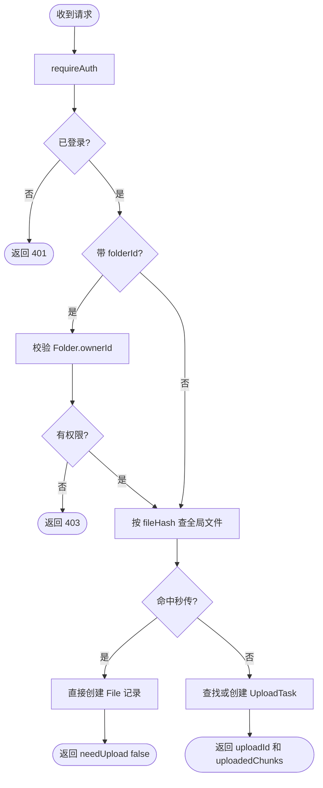
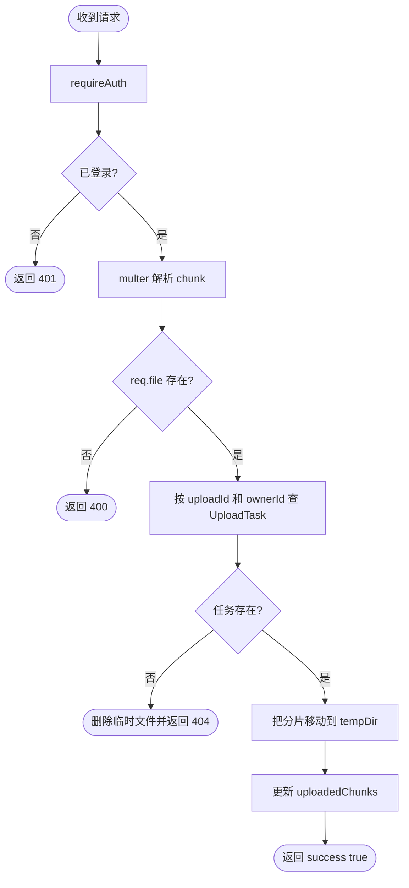
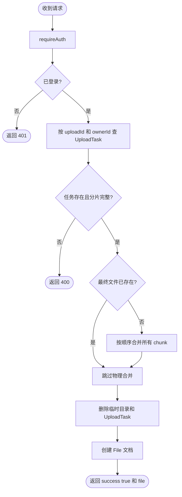

# 鉴权相关接口清单

这份文档把当前鉴权体系下最关键的业务接口单独拆出来，逐条说明：

- 接口路径与方法
- 是否要求登录
- 参数类型
- 成功响应类型
- 常见错误
- 后端处理流程

范围说明：

- 本文重点覆盖 `Note`、`File`、`Meeting` 三个和当前鉴权边界最相关的模块。
- `/api/auth/*` 由 `better-auth` 框架托管，仓库里没有逐个 endpoint 的本地实现，因此这里只说明业务接口。
- 除了特殊说明，标准成功包装是 `SuccessEnvelope<T>`，统一错误中间件包装是 `ErrorEnvelope`。

## 通用响应类型

```ts
type SuccessEnvelope<T> = {
  code: 1;
  message: string;
  data: T;
};

type ErrorEnvelope = {
  code: 0;
  message: string;
  data: null;
  error?: string;
};
```

## 领域类型速览

```ts
type NoteDocument = {
  _id: string;
  userId: string;
  title: string;
  content: string;
  watched: number;
  like: number;
  password: string | null;
  cover: string;
  children: string[];
  parentId: string | null;
  date: string | Date;
  meta: Record<string, unknown>;
  createdAt: string | Date;
  updatedAt: string | Date;
};

type NoteSummary = Omit<NoteDocument, "content">;

type SearchNoteResult = NoteDocument & {
  pathLabel: string;
};

type FileDocument = {
  _id: string;
  name: string;
  extension?: string;
  mimeType?: string;
  size: string;
  hash: string;
  folderId: string | null;
  ownerId: string;
  storagePath: string;
  status: "active" | "recycled" | "processing";
  createdAt: string | Date;
  updatedAt: string | Date;
};

type FolderDocument = {
  _id: string;
  name: string;
  parentId: string | null;
  path: string;
  ownerId: string;
  createdAt: string | Date;
  updatedAt: string | Date;
};

type MeetingDocument = {
  _id: string;
  title: string;
  hostId: string;
  startTime: string | Date;
  duration: number;
  password?: string;
  endedAt?: string | Date | null;
  createdAt: string | Date;
  updatedAt: string | Date;
};

type MeetingCommentDocument = {
  _id: string;
  meetingId: string;
  roomId: string;
  content: string;
  userId: string;
  name: string;
  avatar: string;
  email: string;
  createdAt: string | Date;
  updatedAt: string | Date;
};

type MeetingAccessResult = {
  passed: boolean;
  reason: "OK" | "INVALID_PASSWORD" | "NOT_FOUND";
};
```

## 接口索引

| 方法 | 路径 | 鉴权要求 | 模块 |
| --- | --- | --- | --- |
| `POST` | `/note/create` | 需要登录 | Note |
| `PUT` | `/note/content` | 需要登录 | Note |
| `PUT` | `/note/properties` | 需要登录 | Note |
| `GET` | `/note/roots` | 公开 | Note |
| `GET` | `/note/children` | 需要登录 | Note |
| `GET` | `/note/detail` | 需要登录 | Note |
| `DELETE` | `/note/delete` | 需要登录 | Note |
| `GET` | `/note/getNote` | 公开 | Note |
| `GET` | `/note/recent` | 需要登录 | Note |
| `POST` | `/note/search` | 需要登录 | Note |
| `POST` | `/file/init` | 需要登录 | File |
| `POST` | `/file/uploadchunk` | 需要登录 | File |
| `POST` | `/file/merge` | 需要登录 | File |
| `POST` | `/file/delete` | 需要登录 | File |
| `POST` | `/file/delete-batch` | 需要登录 | File |
| `POST` | `/file/list` | 需要登录 | File |
| `POST` | `/file/createfolder` | 需要登录 | File |
| `GET` | `/file/folders` | 需要登录 | File |
| `POST` | `/file/rename` | 需要登录 | File |
| `POST` | `/file/move` | 需要登录 | File |
| `GET` | `/file/download/:fileId` | 需要登录 | File |
| `GET` | `/file/preview/:fileId` | 需要登录 | File |
| `POST` | `/meeting/create` | 需要登录 | Meeting |
| `GET` | `/meeting/findMyMeeting` | 需要登录 | Meeting |
| `POST` | `/meeting/findByPage` | 公开 | Meeting |
| `POST` | `/meeting/vetMeeting` | 公开，需复核 | Meeting |
| `GET` | `/meeting/findAllMeeting` | 公开 | Meeting |
| `DELETE` | `/meeting/delete` | 公开，需复核 | Meeting |
| `GET` | `/meeting/findById` | 公开 | Meeting |
| `GET` | `/meeting/comments` | 公开 | Meeting |
| `POST` | `/meeting/validateAccess` | 公开 | Meeting |

## Note 模块

### `POST /note/create`

- 鉴权要求：需要登录
- 源码：[server/app/routes/note.ts](/e:/Code/D-NOTE/server/app/routes/note.ts)
- 作用：创建笔记，并把当前登录用户写入 `userId`

请求参数：

```ts
type Body = {
  title: string;
  content?: string;
  parentId?: string;
  meta?: Record<string, unknown>;
};
```

成功响应：

```ts
type Response = SuccessEnvelope<NoteDocument>;
```

常见错误：

- `401` 未登录
- `400` 请求体不满足 zod 校验
- `500` 数据库存储失败

后端流程图：

```mermaid
flowchart TD
  A([收到请求]) --> B[requireAuth]
  B --> C{存在 session.user?}
  C -- 否 --> Z([返回 401])
  C -- 是 --> D[zod 校验 body]
  D --> E[getUser(req)]
  E --> F[createNote 写入 userId]
  F --> G([successResponse 返回笔记])
```

### `PUT /note/content`

- 鉴权要求：需要登录
- 源码：[server/app/routes/note.ts](/e:/Code/D-NOTE/server/app/routes/note.ts)
- 作用：更新笔记正文内容

请求参数：

```ts
type Body = {
  noteId: string;
  content: string;
};
```

成功响应：

```ts
type Response = SuccessEnvelope<NoteDocument | null>;
```

常见错误：

- `401` 未登录
- `400` `noteId` 或 `content` 缺失
- `401` 笔记归属校验失败

备注：

- 当前实现里 `validateNoteUser()` 是异步函数，但调用处没有 `await`，这是一个权限风险点。

后端流程图：



### `PUT /note/properties`

- 鉴权要求：需要登录
- 源码：[server/app/routes/note.ts](/e:/Code/D-NOTE/server/app/routes/note.ts)
- 作用：更新笔记元信息，如 `parentId`、`meta`、`cover`

请求参数：

```ts
type Body = {
  noteId: string;
  parentId?: string;
  meta?: Record<string, unknown>;
  cover?: string;
};
```

成功响应：

```ts
type Response = SuccessEnvelope<NoteDocument | null>;
```

常见错误：

- `401` 未登录
- `400` `noteId` 缺失
- `401` 笔记归属校验失败

备注：

- 这里同样存在 `validateNoteUser()` 未 `await` 的风险。

后端流程图：



### `GET /note/roots`

- 鉴权要求：公开
- 源码：[server/app/routes/note.ts](/e:/Code/D-NOTE/server/app/routes/note.ts)
- 作用：根据 `owner` 查询根节点笔记

请求参数：

```ts
type Query = {
  owner: string;
};
```

成功响应：

```ts
type Response = SuccessEnvelope<NoteSummary[]>;
```

常见错误：

- `400` 缺少 `owner`
- `500` 查询失败

后端流程图：

```mermaid
flowchart TD
  A([收到请求]) --> B[读取 query.owner]
  B --> C{owner 存在?}
  C -- 否 --> Z([返回 400])
  C -- 是 --> D[getRootNotes(owner)]
  D --> E([successResponse 返回列表])
```

### `GET /note/children`

- 鉴权要求：需要登录
- 源码：[server/app/routes/note.ts](/e:/Code/D-NOTE/server/app/routes/note.ts)
- 作用：查询某个父笔记的直接子笔记

请求参数：

```ts
type Query = {
  parentId: string;
};
```

成功响应：

```ts
type Response = SuccessEnvelope<NoteSummary[]>;
```

常见错误：

- `401` 未登录
- `400` 缺少 `parentId`

后端流程图：

```mermaid
flowchart TD
  A([收到请求]) --> B[requireAuth]
  B --> C{已登录?}
  C -- 否 --> Z([返回 401])
  C -- 是 --> D[校验 query.parentId]
  D --> E[getDirectChildren(parentId)]
  E --> F([successResponse 返回列表])
```

### `GET /note/detail`

- 鉴权要求：需要登录
- 源码：[server/app/routes/note.ts](/e:/Code/D-NOTE/server/app/routes/note.ts)
- 作用：查询单篇笔记详情

请求参数：

```ts
type Query = {
  noteId: string;
};
```

成功响应：

```ts
type Response = SuccessEnvelope<NoteDocument | null>;
```

常见错误：

- `401` 未登录
- `400` 缺少 `noteId`

后端流程图：

```mermaid
flowchart TD
  A([收到请求]) --> B[requireAuth]
  B --> C{已登录?}
  C -- 否 --> Z([返回 401])
  C -- 是 --> D[校验 query.noteId]
  D --> E[getNoteById(noteId)]
  E --> F([successResponse 返回详情])
```

### `DELETE /note/delete`

- 鉴权要求：需要登录
- 源码：[server/app/routes/note.ts](/e:/Code/D-NOTE/server/app/routes/note.ts)
- 作用：递归删除笔记及其子笔记

请求参数：

```ts
type Body = {
  noteId: string;
};
```

成功响应：

```ts
type Response = SuccessEnvelope<null>;
```

常见错误：

- `401` 未登录
- `400` 缺少 `noteId`
- `401` 笔记归属校验失败

备注：

- 这里也依赖 `validateNoteUser()`，当前调用没有 `await`。

后端流程图：



### `GET /note/getNote`

- 鉴权要求：公开
- 源码：[server/app/routes/note.ts](/e:/Code/D-NOTE/server/app/routes/note.ts)
- 作用：根据 `userId` 查询叶子笔记列表

请求参数：

```ts
type Query = {
  userId: string;
};
```

成功响应：

```ts
type Response = SuccessEnvelope<NoteDocument[]>;
```

常见错误：

- `400` 缺少 `userId`
- `500` 查询失败

后端流程图：

```mermaid
flowchart TD
  A([收到请求]) --> B[读取 query.userId]
  B --> C{userId 存在?}
  C -- 否 --> Z([返回 400])
  C -- 是 --> D[getNotes(userId)]
  D --> E([successResponse 返回列表])
```

### `GET /note/recent`

- 鉴权要求：需要登录
- 源码：[server/app/routes/note.ts](/e:/Code/D-NOTE/server/app/routes/note.ts)
- 作用：查询当前用户最近更新的叶子笔记

请求参数：

```ts
type Query = {};
```

成功响应：

```ts
type Response = SuccessEnvelope<NoteDocument[]>;
```

常见错误：

- `401` 未登录
- `500` 查询失败

后端流程图：

```mermaid
flowchart TD
  A([收到请求]) --> B[requireAuth]
  B --> C{已登录?}
  C -- 否 --> Z([返回 401])
  C -- 是 --> D[getUser(req)]
  D --> E[getRecentNotes(owner.id)]
  E --> F([successResponse 返回列表])
```

### `POST /note/search`

- 鉴权要求：需要登录
- 源码：[server/app/routes/note.ts](/e:/Code/D-NOTE/server/app/routes/note.ts)
- 作用：按标题模糊搜索当前用户笔记，并补充 `pathLabel`

请求参数：

```ts
type Body = {
  title: string;
};
```

成功响应：

```ts
type Response = SuccessEnvelope<SearchNoteResult[]>;
```

常见错误：

- `401` 未登录
- `500` 搜索失败

后端流程图：

```mermaid
flowchart TD
  A([收到请求]) --> B[requireAuth]
  B --> C{已登录?}
  C -- 否 --> Z([返回 401])
  C -- 是 --> D[getUser(req)]
  D --> E[searchNotes(owner.id, title)]
  E --> F[为结果构造 pathLabel]
  F --> G([successResponse 返回结果])
```

## File 模块

### `POST /file/init`

- 鉴权要求：需要登录
- 源码：[server/app/routes/file.ts](/e:/Code/D-NOTE/server/app/routes/file.ts)
- 作用：初始化上传任务；如果命中秒传条件，会直接创建逻辑文件并跳过上传

请求参数：

```ts
type Body = {
  fileName: string;
  fileHash: string;
  totalSize: string | number;
  totalChunksSize: number;
  folderId?: string;
};
```

成功响应：

```ts
type FileInitResult =
  | {
      code: 1;
      message: string;
      data: { needUpload: false };
    }
  | {
      code: 1;
      message: string;
      data: {
        status: "UPLOADING";
        uploadId: string;
        uploadedChunks: number[];
      };
    };
```

常见错误：

- `401` 未登录
- `403` `folderId` 不属于当前用户
- `500` 初始化失败

后端流程图：



### `POST /file/uploadchunk`

- 鉴权要求：需要登录
- 源码：[server/app/routes/file.ts](/e:/Code/D-NOTE/server/app/routes/file.ts)
- 作用：上传单个分片文件，并记录该分片已完成

请求参数：

```ts
type Body = FormData<{
  uploadId: string;
  chunkIndex: number;
  chunk: File;
}>;
```

成功响应：

```ts
type Response = {
  success: true;
};
```

常见错误：

- `401` 未登录
- `400` 缺少分片文件
- `404` 上传任务不存在或不属于当前用户

后端流程图：



### `POST /file/merge`

- 鉴权要求：需要登录
- 源码：[server/app/routes/file.ts](/e:/Code/D-NOTE/server/app/routes/file.ts)
- 作用：在全部分片完成后合并文件，清理临时任务，并落库成正式文件

请求参数：

```ts
type Body = {
  uploadId: string;
};
```

成功响应：

```ts
type Response = {
  success: true;
  file: FileDocument;
};
```

常见错误：

- `401` 未登录
- `400` 分片数量异常或分片不完整
- `500` 合并失败或写盘失败

后端流程图：


