# File 模块接口

## 类型速览

```ts
type SuccessEnvelope<T> = {
  code: 1;
  message: string;
  data: T;
};

type FileDocument = {
  _id: string;
  name: string;
  extension?: string;
  mimeType?: string;
  size: string;
  hash: string;
  folderId: string | null;
  ownerId: string;
  storagePath: string;
  status: "active" | "recycled" | "processing";
  createdAt: string | Date;
  updatedAt: string | Date;
};

type FolderDocument = {
  _id: string;
  name: string;
  parentId: string | null;
  path: string;
  ownerId: string;
  createdAt: string | Date;
  updatedAt: string | Date;
};
```

### `POST /file/init`

- 鉴权要求：需要登录
- 源码：[server/app/routes/file.ts](/e:/Code/D-NOTE/server/app/routes/file.ts)
- 作用：初始化上传任务；如果命中秒传条件，会直接创建逻辑文件并跳过上传

请求参数：

```ts
type Body = {
  fileName: string;
  fileHash: string;
  totalSize: string | number;
  totalChunksSize: number;
  folderId?: string;
};
```

成功响应：

```ts
type FileInitResult =
  | SuccessEnvelope<{ needUpload: false }>
  | SuccessEnvelope<{
      status: "UPLOADING";
      uploadId: string;
      uploadedChunks: number[];
    }>;
```

常见错误：

- `401` 未登录
- `403` `folderId` 不属于当前用户
- `500` 初始化失败

后端流程图：

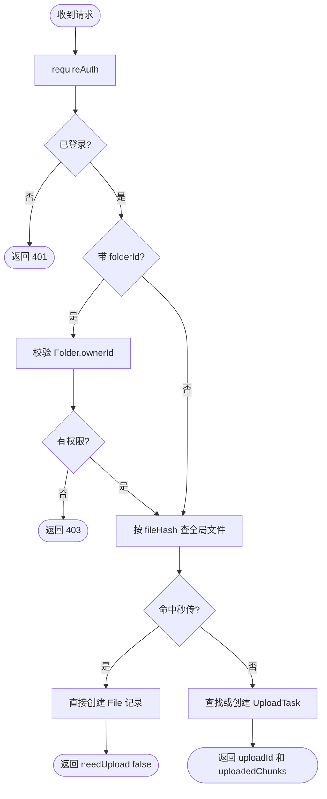

### `POST /file/uploadchunk`

- 鉴权要求：需要登录
- 源码：[server/app/routes/file.ts](/e:/Code/D-NOTE/server/app/routes/file.ts)
- 作用：上传单个分片文件，并记录该分片已完成

请求参数：

```ts
type Body = FormData<{
  uploadId: string;
  chunkIndex: number;
  chunk: File;
}>;
```

成功响应：

```ts
type Response = {
  success: true;
};
```

常见错误：

- `401` 未登录
- `400` 缺少分片文件
- `404` 上传任务不存在或不属于当前用户

后端流程图：

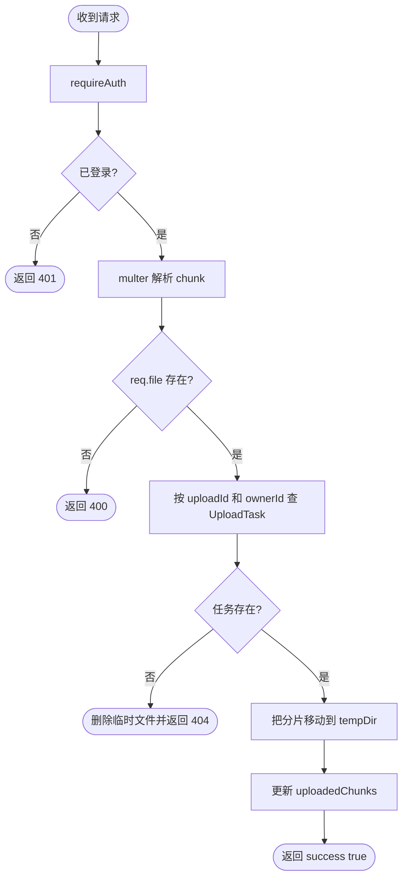

### `POST /file/merge`

- 鉴权要求：需要登录
- 源码：[server/app/routes/file.ts](/e:/Code/D-NOTE/server/app/routes/file.ts)
- 作用：在全部分片完成后合并文件，清理临时任务，并落库成正式文件

请求参数：

```ts
type Body = {
  uploadId: string;
};
```

成功响应：

```ts
type Response = {
  success: true;
  file: FileDocument;
};
```

常见错误：

- `401` 未登录
- `400` 分片数量异常或分片不完整
- `500` 合并失败或写盘失败

后端流程图：

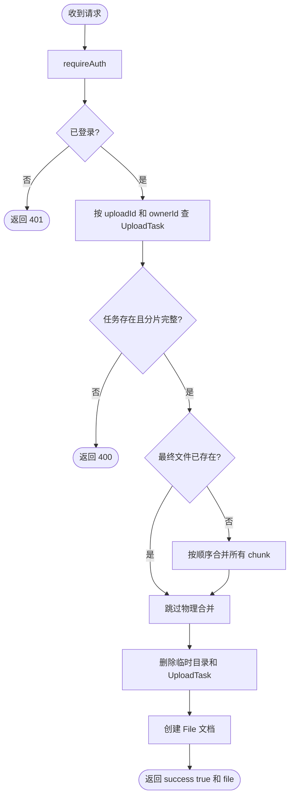

### `POST /file/delete`

- 鉴权要求：需要登录
- 源码：[server/app/routes/file.ts](/e:/Code/D-NOTE/server/app/routes/file.ts)
- 作用：删除单个文件或文件夹，并在需要时清理孤立物理文件

请求参数：

```ts
type Body = {
  fileId?: string;
  kind?: "file" | "folder";
};
```

成功响应：

```ts
type Response = SuccessEnvelope<{
  deletedFileCount: number;
  deletedFolderCount: number;
  missingFileIds: string[];
  missingFolderIds: string[];
}>;
```

常见错误：

- `401` 未登录
- `400` `fileId` 为空
- `404` 文件不存在或无权操作

后端流程图：

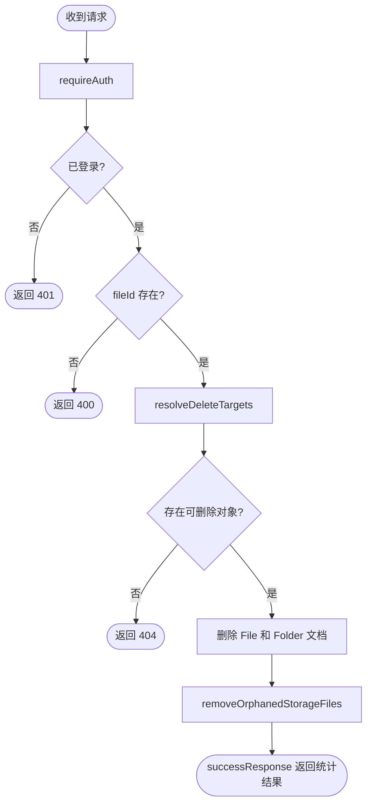

### `POST /file/delete-batch`

- 鉴权要求：需要登录
- 源码：[server/app/routes/file.ts](/e:/Code/D-NOTE/server/app/routes/file.ts)
- 作用：批量删除多个文件或文件夹

请求参数：

```ts
type Body = {
  fileIds?: string[];
  targets?: Array<{
    id: string;
    kind: "file" | "folder";
  }>;
};
```

成功响应：

```ts
type Response = SuccessEnvelope<{
  deletedCount: number;
  deletedFileCount: number;
  deletedFolderCount: number;
  deletedIds: string[];
  missingFileIds: string[];
  missingFolderIds: string[];
}>;
```

常见错误：

- `401` 未登录
- `400` `targets` 为空
- `404` 不存在任何可删除对象

后端流程图：

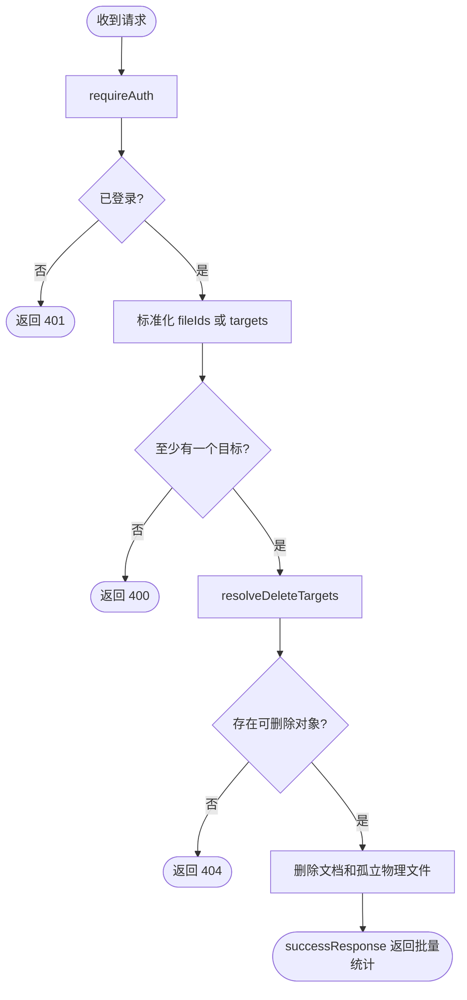

### `POST /file/list`

- 鉴权要求：需要登录
- 源码：[server/app/routes/file.ts](/e:/Code/D-NOTE/server/app/routes/file.ts)
- 作用：列出当前目录下的文件和文件夹

请求参数：

```ts
type Body = {
  parentId?: string | "root";
};
```

成功响应：

```ts
type Response = SuccessEnvelope<{
  folders: FolderDocument[];
  files: FileDocument[];
}>;
```

常见错误：

- `401` 未登录
- `500` 查询失败

后端流程图：

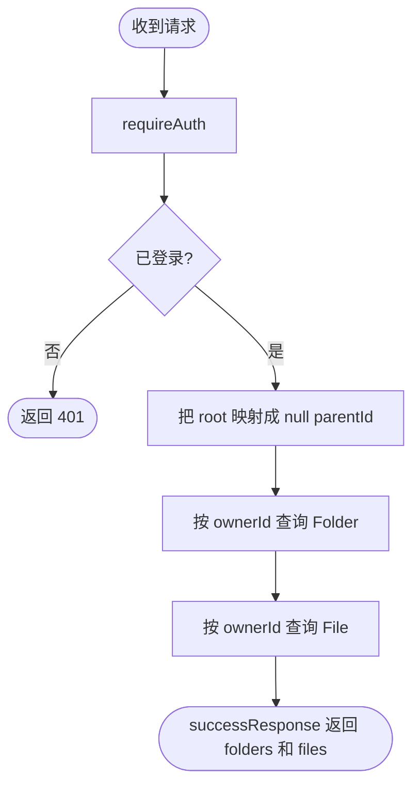

### `POST /file/createfolder`

- 鉴权要求：需要登录
- 源码：[server/app/routes/file.ts](/e:/Code/D-NOTE/server/app/routes/file.ts)
- 作用：创建文件夹

请求参数：

```ts
type Body = {
  name: string;
  parentId?: string;
};
```

成功响应：

```ts
type Response = SuccessEnvelope<FolderDocument>;
```

常见错误：

- `401` 未登录
- `500` 创建失败

后端流程图：

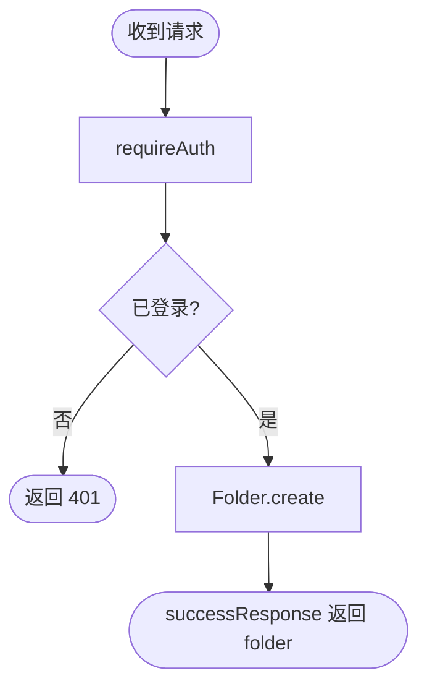

### `GET /file/folders`

- 鉴权要求：需要登录
- 源码：[server/app/routes/file.ts](/e:/Code/D-NOTE/server/app/routes/file.ts)
- 作用：查询当前用户的所有文件夹

请求参数：

```ts
type Query = {};
```

成功响应：

```ts
type Response = SuccessEnvelope<FolderDocument[]>;
```

常见错误：

- `401` 未登录
- `500` 查询失败

后端流程图：

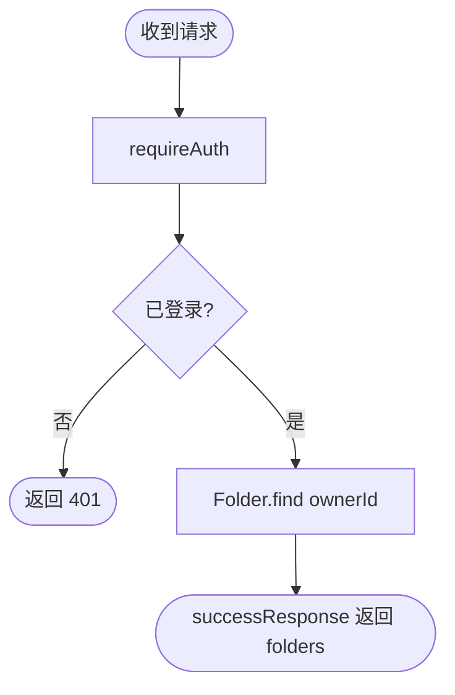

### `POST /file/rename`

- 鉴权要求：需要登录
- 源码：[server/app/routes/file.ts](/e:/Code/D-NOTE/server/app/routes/file.ts)
- 作用：重命名文件或文件夹

请求参数：

```ts
type Body = {
  _id: string;
  name: string;
  kind?: "file" | "folder";
};
```

成功响应：

```ts
type Response = SuccessEnvelope<FileDocument | FolderDocument>;
```

常见错误：

- `401` 未登录
- `400` `_id` 或 `name` 为空
- `404` 对象不存在或无权操作

后端流程图：

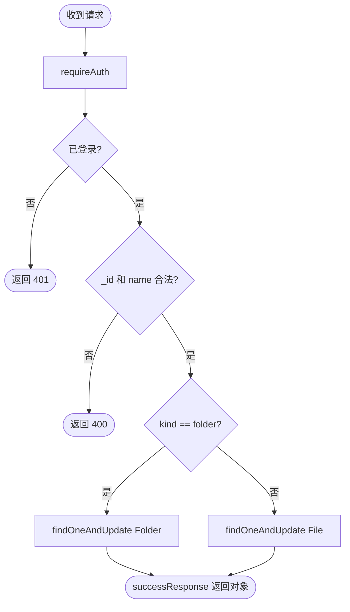

### `POST /file/move`

- 鉴权要求：需要登录
- 源码：[server/app/routes/file.ts](/e:/Code/D-NOTE/server/app/routes/file.ts)
- 作用：移动文件或文件夹到目标目录

请求参数：

```ts
type Body = {
  _id: string;
  kind?: "file" | "folder";
  targetFolderId: string;
};
```

成功响应：

```ts
type Response = SuccessEnvelope<FileDocument | FolderDocument>;
```

常见错误：

- `401` 未登录
- `400` 参数缺失或非法移动
- `404` 源对象或目标文件夹不存在

后端流程图：

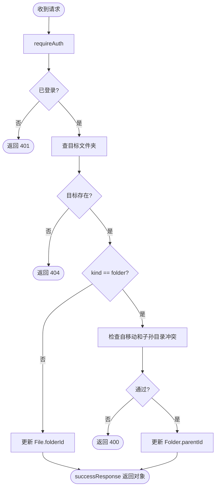

### `GET /file/download/:fileId`

- 鉴权要求：需要登录
- 源码：[server/app/routes/file.ts](/e:/Code/D-NOTE/server/app/routes/file.ts)
- 作用：下载当前用户拥有的文件

请求参数：

```ts
type PathParams = {
  fileId: string;
};
```

成功响应：

```ts
type Response = BinaryDownloadStream;
```

常见错误：

- `401` 未登录
- `404` 文件不存在、无权访问或物理文件缺失

后端流程图：

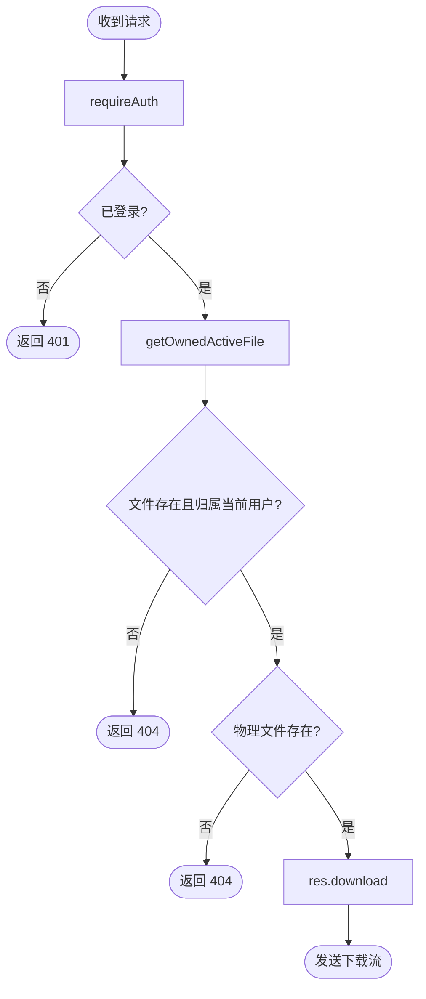

### `GET /file/preview/:fileId`

- 鉴权要求：需要登录
- 源码：[server/app/routes/file.ts](/e:/Code/D-NOTE/server/app/routes/file.ts)
- 作用：以内联方式预览当前用户拥有的文件

请求参数：

```ts
type PathParams = {
  fileId: string;
};
```

成功响应：

```ts
type Response = BinaryInlineStream;
```

常见错误：

- `401` 未登录
- `404` 文件不存在、无权访问或物理文件缺失

后端流程图：

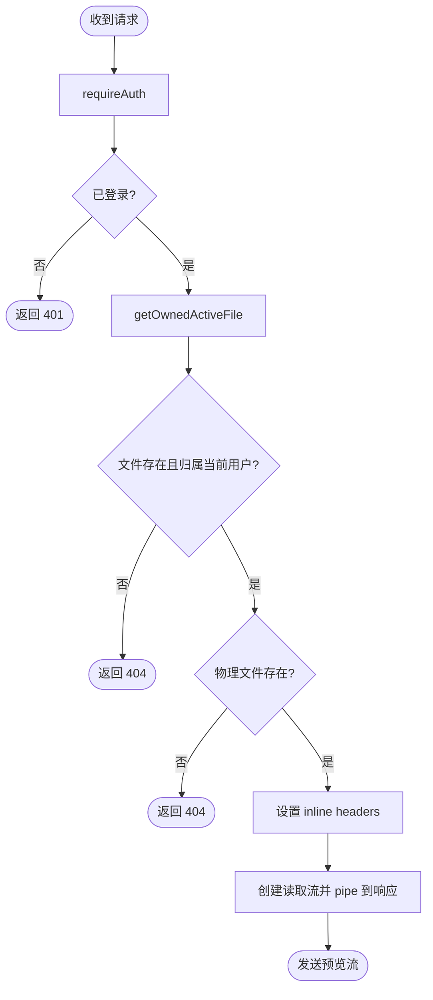
