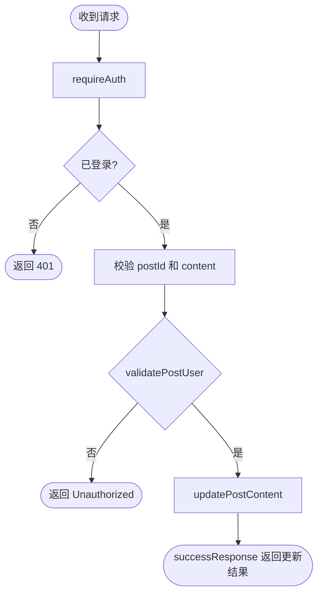
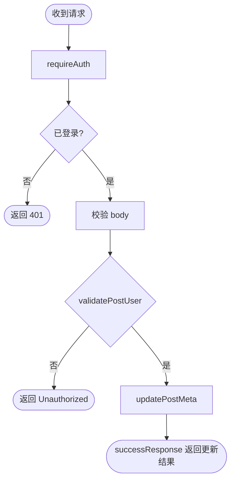
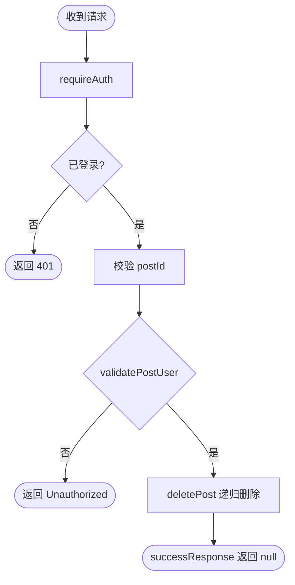

# Post 模块接口

## 类型速览

```ts
type SuccessEnvelope<T> = {
  code: 1;
  message: string;
  data: T;
};

type PostDocument = {
  _id: string;
  userId: string;
  title: string;
  content: string;
  watched: number;
  like: number;
  password: string | null;
  cover: string;
  children: string[];
  parentId: string | null;
  date: string | Date;
  meta: Record<string, unknown>;
  createdAt: string | Date;
  updatedAt: string | Date;
};

type PostSummary = Omit<PostDocument, "content">;

type SearchPostResult = PostDocument & {
  pathLabel: string;
};
```

### `POST /post/create`

- 鉴权要求：需要登录
- 源码：[server/app/routes/post.ts](/e:/Code/D-NOTE/server/app/routes/post.ts)
- 作用：创建文章，并把当前登录用户写入 `userId`

请求参数：

```ts
type Body = {
  title: string;
  content?: string;
  parentId?: string;
  meta?: Record<string, unknown>;
};
```

成功响应：

```ts
type Response = SuccessEnvelope<PostDocument>;
```

常见错误：

- `401` 未登录
- `400` 请求体不满足 zod 校验
- `500` 数据库存储失败

后端流程图：

```mermaid
flowchart TD
  A([收到请求]) --> B[requireAuth]
  B --> C{存在 session.user?}
  C -- 否 --> Z([返回 401])
  C -- 是 --> D[zod 校验 body]
  D --> E[getUser(req)]
  E --> F[createPost 写入 userId]
  F --> G([successResponse 返回文章])
```

### `PUT /post/content`

- 鉴权要求：需要登录
- 源码：[server/app/routes/post.ts](/e:/Code/D-NOTE/server/app/routes/post.ts)
- 作用：更新文章正文内容

请求参数：

```ts
type Body = {
  postId: string;
  content: string;
};
```

成功响应：

```ts
type Response = SuccessEnvelope<PostDocument | null>;
```

常见错误：

- `401` 未登录
- `400` `postId` 或 `content` 缺失
- `401` 文章归属校验失败

备注：

- 当前实现里 `validatePostUser()` 是异步函数，但调用处没有 `await`，这是一个权限风险点。

后端流程图：



### `PUT /post/properties`

- 鉴权要求：需要登录
- 源码：[server/app/routes/post.ts](/e:/Code/D-NOTE/server/app/routes/post.ts)
- 作用：更新文章元信息，如 `parentId`、`meta`、`cover`

请求参数：

```ts
type Body = {
  postId: string;
  parentId?: string;
  meta?: Record<string, unknown>;
  cover?: string;
};
```

成功响应：

```ts
type Response = SuccessEnvelope<PostDocument | null>;
```

常见错误：

- `401` 未登录
- `400` `postId` 缺失
- `401` 文章归属校验失败

备注：

- 这里同样存在 `validatePostUser()` 未 `await` 的风险。

后端流程图：



### `GET /post/roots`

- 鉴权要求：公开
- 源码：[server/app/routes/post.ts](/e:/Code/D-NOTE/server/app/routes/post.ts)
- 作用：根据 `owner` 查询根节点文章

请求参数：

```ts
type Query = {
  owner: string;
};
```

成功响应：

```ts
type Response = SuccessEnvelope<PostSummary[]>;
```

常见错误：

- `400` 缺少 `owner`
- `500` 查询失败

后端流程图：

```mermaid
flowchart TD
  A([收到请求]) --> B[读取 query.owner]
  B --> C{owner 存在?}
  C -- 否 --> Z([返回 400])
  C -- 是 --> D[getRootPosts(owner)]
  D --> E([successResponse 返回列表])
```

### `GET /post/children`

- 鉴权要求：需要登录
- 源码：[server/app/routes/post.ts](/e:/Code/D-NOTE/server/app/routes/post.ts)
- 作用：查询某个父文章的直接子文章

请求参数：

```ts
type Query = {
  parentId: string;
};
```

成功响应：

```ts
type Response = SuccessEnvelope<PostSummary[]>;
```

常见错误：

- `401` 未登录
- `400` 缺少 `parentId`

后端流程图：

```mermaid
flowchart TD
  A([收到请求]) --> B[requireAuth]
  B --> C{已登录?}
  C -- 否 --> Z([返回 401])
  C -- 是 --> D[校验 query.parentId]
  D --> E[getDirectChildren(parentId)]
  E --> F([successResponse 返回列表])
```

### `GET /post/detail`

- 鉴权要求：需要登录
- 源码：[server/app/routes/post.ts](/e:/Code/D-NOTE/server/app/routes/post.ts)
- 作用：查询单篇文章详情

请求参数：

```ts
type Query = {
  postId: string;
};
```

成功响应：

```ts
type Response = SuccessEnvelope<PostDocument | null>;
```

常见错误：

- `401` 未登录
- `400` 缺少 `postId`

后端流程图：

```mermaid
flowchart TD
  A([收到请求]) --> B[requireAuth]
  B --> C{已登录?}
  C -- 否 --> Z([返回 401])
  C -- 是 --> D[校验 query.postId]
  D --> E[getPostById(postId)]
  E --> F([successResponse 返回详情])
```

### `DELETE /post/delete`

- 鉴权要求：需要登录
- 源码：[server/app/routes/post.ts](/e:/Code/D-NOTE/server/app/routes/post.ts)
- 作用：递归删除文章及其子文章

请求参数：

```ts
type Body = {
  postId: string;
};
```

成功响应：

```ts
type Response = SuccessEnvelope<null>;
```

常见错误：

- `401` 未登录
- `400` 缺少 `postId`
- `401` 文章归属校验失败

备注：

- 这里也依赖 `validatePostUser()`，当前调用没有 `await`。

后端流程图：



### `GET /post/getPost`

- 鉴权要求：公开
- 源码：[server/app/routes/post.ts](/e:/Code/D-NOTE/server/app/routes/post.ts)
- 作用：根据 `userId` 查询叶子文章列表

请求参数：

```ts
type Query = {
  userId: string;
};
```

成功响应：

```ts
type Response = SuccessEnvelope<PostDocument[]>;
```

常见错误：

- `400` 缺少 `userId`
- `500` 查询失败

后端流程图：

```mermaid
flowchart TD
  A([收到请求]) --> B[读取 query.userId]
  B --> C{userId 存在?}
  C -- 否 --> Z([返回 400])
  C -- 是 --> D[getPosts(userId)]
  D --> E([successResponse 返回列表])
```

### `GET /post/recent`

- 鉴权要求：需要登录
- 源码：[server/app/routes/post.ts](/e:/Code/D-NOTE/server/app/routes/post.ts)
- 作用：查询当前用户最近更新的叶子文章

请求参数：

```ts
type Query = {};
```

成功响应：

```ts
type Response = SuccessEnvelope<PostDocument[]>;
```

常见错误：

- `401` 未登录
- `500` 查询失败

后端流程图：

```mermaid
flowchart TD
  A([收到请求]) --> B[requireAuth]
  B --> C{已登录?}
  C -- 否 --> Z([返回 401])
  C -- 是 --> D[getUser(req)]
  D --> E[getRencentPosts(owner.id)]
  E --> F([successResponse 返回列表])
```

### `POST /post/search`

- 鉴权要求：需要登录
- 源码：[server/app/routes/post.ts](/e:/Code/D-NOTE/server/app/routes/post.ts)
- 作用：按标题模糊搜索当前用户文章，并补充 `pathLabel`

请求参数：

```ts
type Body = {
  title: string;
};
```

成功响应：

```ts
type Response = SuccessEnvelope<SearchPostResult[]>;
```

常见错误：

- `401` 未登录
- `500` 搜索失败

后端流程图：

```mermaid
flowchart TD
  A([收到请求]) --> B[requireAuth]
  B --> C{已登录?}
  C -- 否 --> Z([返回 401])
  C -- 是 --> D[getUser(req)]
  D --> E[searchPosts(owner.id, title)]
  E --> F[为结果构造 pathLabel]
  F --> G([successResponse 返回结果])
```
