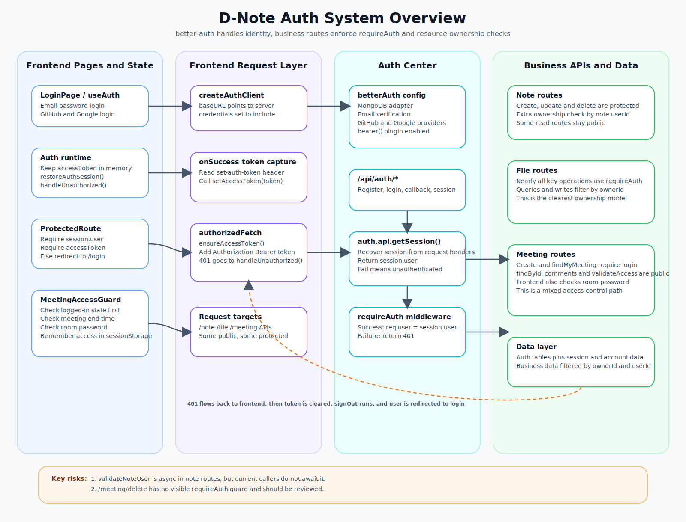

# 鉴权系统说明

## 概览

当前项目的鉴权体系可以概括成四层：

1. 前端使用 `better-auth/react` 发起登录、注册、第三方登录与会话恢复。
2. `better-auth` 服务端挂载在 `/api/auth/*`，负责用户身份校验、邮箱验证、第三方 OAuth 和会话生成。
3. 前端把拿到的 bearer token 注入业务请求的 `Authorization` 头。
4. 服务端通过 `requireAuth` 中间件和资源 `ownerId` / `userId` 过滤完成接口保护。

从代码结构看，这个系统是“会话 + Bearer Token 混合模式”：

- 登录态由 `better-auth` 维护。
- 前端运行时还会单独保存一个 `accessToken`。
- 业务接口主要依赖 `Authorization: Bearer <token>`。

## 核心组件

### 1. 服务端认证中心

文件：[server/app/lib/auth.ts](/e:/Code/D-NOTE/server/app/lib/auth.ts)

这里初始化了 `better-auth`，关键点有：

- 使用 MongoDB 作为认证数据存储。
- 认证入口统一挂载在 `/api/auth`。
- 开启邮箱密码登录。
- 邮箱密码注册要求先完成邮箱验证。
- 开启 GitHub / Google 第三方登录。
- 挂载 `bearer()` 插件，使会话可向业务接口提供 Bearer Token 能力。
- 会话有效期为 7 天，`updateAge` 为 1 天。

### 2. 服务端统一鉴权中间件

文件：[server/app/middleware/session.ts](/e:/Code/D-NOTE/server/app/middleware/session.ts)

`requireAuth` 的职责很直接：

- 调用 `auth.api.getSession({ headers: req.headers })`
- 如果取不到 `session.user`，直接返回 `401 Unauthorized`
- 如果成功，写入 `req.user`
- 后续业务路由直接使用 `req.user.id`

这意味着业务接口本身不解析 JWT，也不自己校验 token，而是统一交给 `better-auth`。

### 3. 前端认证运行时

文件：[client/src/utils/auth.ts](/e:/Code/D-NOTE/client/src/utils/auth.ts)

前端有一套独立的认证运行时状态，主要负责：

- 用 `createAuthClient` 创建 `better-auth` 客户端。
- 在 `onSuccess` 中从响应头读取 `set-auth-token`。
- 把 token 保存在运行时内存里，而不是 `localStorage`。
- 启动时执行 `restoreAuthSession()`，尝试恢复 session 和 token。
- 遇到 `401` 时清掉本地认证状态并跳回登录页。

### 4. 前端业务请求封装

文件：[client/src/api/request.ts](/e:/Code/D-NOTE/client/src/api/request.ts)

所有受保护的业务请求会经过：

1. `ensureAccessToken()`
2. `withAuthHeaders()`
3. `authorizedFetch()`

执行效果：

- 若当前内存里没有 token，先尝试 `restoreAuthSession()`
- 拿到 token 后自动补 `Authorization: Bearer <token>`
- 如果服务端返回 `401`，执行 `handleUnauthorized()`

## 主流程

### 登录与会话建立

入口文件：

- [client/src/views/Login/index.tsx](/e:/Code/D-NOTE/client/src/views/Login/index.tsx)
- [client/src/hooks/useAuth.ts](/e:/Code/D-NOTE/client/src/hooks/useAuth.ts)

支持三种入口：

- 邮箱密码登录
- GitHub 登录
- Google 登录

登录成功后，前端会：

1. 通过 `better-auth` 完成认证。
2. 从返回的 session 或响应头中提取 token。
3. 调用 `setAccessToken(token)` 保存到运行时内存。
4. `refetchSession()` 拉取最新用户态。
5. 跳转到目标页面。

### 应用启动与会话恢复

文件：[client/src/AppProvider.tsx](/e:/Code/D-NOTE/client/src/AppProvider.tsx)

应用启动时会调用 `restoreAuthSession()`：

- 如果能拿到 session.user 和 token，则视为已登录。
- 否则清空 token，并把运行时状态标记为初始化完成。

路由守卫位于：

- [client/src/Route.tsx](/e:/Code/D-NOTE/client/src/Route.tsx)

`ProtectedRoute` 的判断条件是：

- `initialized === true`
- `sessionPending === false`
- `isAuthenticated === !!session?.user && !!accessToken`

也就是说，这套系统要求“用户信息”和“accessToken”同时存在，才会放行业务页面。

### 受保护业务接口访问

典型链路如下：

1. 页面发起业务请求。
2. `authorizedFetch()` 自动补 Bearer Token。
3. 服务端路由先经过 `requireAuth`。
4. `requireAuth` 从请求头恢复 session。
5. 成功后把用户挂到 `req.user`。
6. 业务代码继续根据 `req.user.id` 查询或更新数据。

## 授权方式

当前项目的授权以“资源归属校验”为主，不是角色权限模型。

### Note 模块

文件：[server/app/routes/note.ts](/e:/Code/D-NOTE/server/app/routes/note.ts)

主要策略：

- 写接口大多先走 `requireAuth`
- 再通过 `getUser(req)` 拿当前用户
- 部分接口调用 `validateNoteUser(user.id, noteId)` 做笔记归属校验

注意点：

- `validateNoteUser(...)` 在当前代码里是异步函数，但调用处没有 `await`
- 这会让条件判断失真，属于一个需要尽快修复的授权风险点

### File 模块

文件：[server/app/routes/file.ts](/e:/Code/D-NOTE/server/app/routes/file.ts)

这是当前授权做得最完整的一块，特点是：

- 全部关键接口都先经过 `requireAuth`
- 查询、重命名、移动、删除、下载、预览都带 `ownerId: userId`
- 删除文件夹时会递归计算子孙目录，但仍限定在当前用户拥有的目录树内

这一层属于典型的“认证通过后，再按资源 ownerId 做细粒度授权”。

### Meeting 模块

文件：[server/app/routes/meeting.ts](/e:/Code/D-NOTE/server/app/routes/meeting.ts)

会议模块是一个混合模式：

- 创建会议、查询“我的会议”要求登录
- 查询会议详情、会议评论、会议分页、校验会议密码则允许匿名访问

前端还有一个补充门禁：

- [client/src/views/MeetingRoom/MeetingAccessGuard.tsx](/e:/Code/D-NOTE/client/src/views/MeetingRoom/MeetingAccessGuard.tsx)

会议室进入逻辑不是单纯依赖后端 token，还叠加了：

- 是否已登录
- 会议是否已结束
- 会议密码是否正确
- 当前房间是否已在 `sessionStorage` 中标记为通过

所以会议模块更像“登录态 + 房间密码 + 前端临时通行记录”的组合访问控制。

## 公开接口与受保护接口

从当前代码看，可以粗分为两类：

### 公开接口

- `/api/auth/*` 认证框架自己的接口
- 部分笔记查询接口，如 `/note/roots`、`/note/getNote`
- 部分会议接口，如 `/meeting/findById`、`/meeting/comments`、`/meeting/validateAccess`

### 受保护接口

- 大部分文件管理接口
- 笔记创建、修改、删除、最近列表、搜索
- 会议创建和“我的会议”
- 受 `ProtectedRoute` 保护的前端业务页面

## 接口清单

下面这份清单聚焦“和鉴权边界直接相关”的接口，而不是把所有业务字段都展开。

### 认证中心接口

| 接口前缀 | 方法 | 鉴权要求 | 说明 |
| --- | --- | --- | --- |
| `/api/auth/*` | `ALL` | 无需先登录 | 由 `better-auth` 接管，包含注册、登录、邮箱验证、OAuth 回调、获取 session、登出等认证能力 |

### Note 模块

| 接口 | 方法 | 鉴权要求 | 说明 |
| --- | --- | --- | --- |
| `/note/create` | `POST` | 需要登录 | 创建笔记 |
| `/note/content` | `PUT` | 需要登录 | 修改笔记内容，按 `note.userId` 做归属校验 |
| `/note/properties` | `PUT` | 需要登录 | 修改笔记属性，按 `note.userId` 做归属校验 |
| `/note/roots` | `GET` | 公开 | 根据 `owner` 查询根节点笔记 |
| `/note/children` | `GET` | 需要登录 | 查询子节点 |
| `/note/detail` | `GET` | 需要登录 | 查询笔记详情 |
| `/note/delete` | `DELETE` | 需要登录 | 删除笔记，按 `note.userId` 做归属校验 |
| `/note/getNote` | `GET` | 公开 | 根据 `userId` 查询笔记列表 |
| `/note/recent` | `GET` | 需要登录 | 查询当前用户最近笔记 |
| `/note/search` | `POST` | 需要登录 | 搜索当前用户笔记 |

### File 模块

| 接口 | 方法 | 鉴权要求 | 说明 |
| --- | --- | --- | --- |
| `/file/init` | `POST` | 需要登录 | 初始化上传任务 |
| `/file/uploadchunk` | `POST` | 需要登录 | 上传分片 |
| `/file/merge` | `POST` | 需要登录 | 合并分片并生成文件 |
| `/file/delete` | `POST` | 需要登录 | 删除单个文件或文件夹，按 `ownerId` 校验 |
| `/file/delete-batch` | `POST` | 需要登录 | 批量删除，按 `ownerId` 校验 |
| `/file/list` | `POST` | 需要登录 | 列出当前目录文件和文件夹 |
| `/file/createfolder` | `POST` | 需要登录 | 创建文件夹 |
| `/file/folders` | `GET` | 需要登录 | 获取当前用户所有文件夹 |
| `/file/rename` | `POST` | 需要登录 | 重命名文件或文件夹 |
| `/file/move` | `POST` | 需要登录 | 移动文件或文件夹 |
| `/file/download/:fileId` | `GET` | 需要登录 | 下载文件，按 `ownerId` 校验 |
| `/file/preview/:fileId` | `GET` | 需要登录 | 预览文件，按 `ownerId` 校验 |

### Meeting 模块

| 接口 | 方法 | 鉴权要求 | 说明 |
| --- | --- | --- | --- |
| `/meeting/create` | `POST` | 需要登录 | 创建会议，当前用户成为 `hostId` |
| `/meeting/findMyMeeting` | `GET` | 需要登录 | 查询当前用户主持的会议 |
| `/meeting/findByPage` | `POST` | 公开 | 分页查询会议 |
| `/meeting/vetMeeting` | `POST` | 公开 | 更新会议状态，当前代码未见登录保护 |
| `/meeting/findAllMeeting` | `GET` | 公开 | 查询全部会议 |
| `/meeting/delete` | `DELETE` | 公开，需重点复核 | 当前未见 `requireAuth`，存在权限边界风险 |
| `/meeting/findById` | `GET` | 公开 | 查询会议详情 |
| `/meeting/comments` | `GET` | 公开 | 查询会议评论 |
| `/meeting/validateAccess` | `POST` | 公开 | 校验会议访问密码 |

### 其他业务接口

这几块我没有展开做逐条安全分析，但从当前代码能看到它们也属于业务入口：

| 接口前缀 | 鉴权现状 | 说明 |
| --- | --- | --- |
| `/summary/*` | 需单独复核 | 文档这次未作为主分析对象 |
| `/comment/*` | 需单独复核 | 文档这次未作为主分析对象 |
| `/image/*` | 需单独复核 | 文档这次未作为主分析对象 |
| `/ai/*` | 需单独复核 | 文档这次未作为主分析对象 |

### 建议你重点关注的接口

如果后续要做权限收敛，我建议先复核这几类：

- `POST /meeting/vetMeeting`
- `DELETE /meeting/delete`
- `GET /note/roots`
- `GET /note/getNote`
- 所有未经过 `requireAuth` 但又可能暴露业务数据的接口

## 401 失败处理

当前项目的失败回收链路很清晰：

1. 服务端鉴权失败返回 `401`
2. 前端 `authorizedFetch()` 捕获到 `401`
3. 调用 `handleUnauthorized()`
4. 清空本地 token
5. 调用 `authClient.signOut()`
6. 跳转到 `/login?returnTo=...`

这一点保证了前后端状态不一致时，用户会被拉回统一登录入口。

## 当前系统的优点

- 认证入口集中，`/api/auth/*` 与业务路由职责分明。
- 前端请求注入 Bearer Token 的方式统一，不需要每个 API 手写。
- 服务端鉴权中间件非常薄，逻辑集中，容易维护。
- 文件模块已经形成了比较清晰的“登录校验 + ownerId 授权”模式。
- 会议模块在产品层面支持“登录后进入 + 房间密码”的复合门禁。

## 当前系统的风险点

### 1. Note 路由存在异步授权判断漏洞

文件：[server/app/routes/note.ts](/e:/Code/D-NOTE/server/app/routes/note.ts)

`validateNoteUser()` 是异步函数，但被当成同步布尔值使用，容易导致未正确等待归属校验结果。

### 2. 部分业务接口是公开的

例如笔记根节点、笔记列表、会议详情等接口没有统一登录保护。

这不一定是 bug，但需要明确它们是否本来就是产品设计上的“公开可读”。

### 3. 会议删除接口未见登录保护

`/meeting/delete` 当前没有 `requireAuth`。

如果这不是管理后台专用接口，就应该补上登录校验和 host 校验。

### 4. 认证状态依赖内存 token

前端 `accessToken` 保存在运行时内存，不会跨刷新永久保存。

好处是更安全，坏处是必须依赖 `restoreAuthSession()` 做恢复。如果恢复链路异常，用户体验会受影响。

## 建议的理解方式

可以把当前系统理解成两段式：

### 第一段：认证

- 由 `better-auth` 负责
- 解决“你是谁”
- 产出 `session.user` 和 token

### 第二段：授权

- 由业务路由自己负责
- 解决“你能不能访问这条数据”
- 主要通过 `ownerId`、`hostId`、`userId` 做资源归属限制

## 结论

这套鉴权系统的主体设计已经成型，核心思路是：

- 用 `better-auth` 统一身份认证
- 用 Bearer Token 打通前后端业务请求
- 用 `requireAuth` 做统一入口拦截
- 用资源归属字段完成业务授权

如果后续要继续演进，最值得优先做的事情是：

1. 修复 `note` 模块里的异步授权判断。
2. 重新梳理会议相关接口的公开/私有边界。
3. 视产品需求决定是否引入更明确的角色权限模型。
