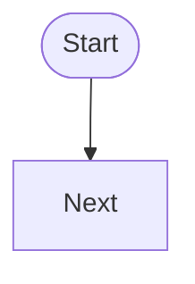

# Flowchart Block

## Overview

编辑器现在支持通过 slash 命令插入流程图块：

- 输入 `/flowchart`
- 插入一个 `mermaid` 代码块
- 块内显示 Notion 风格的图形编辑卡片
- 底层仍保存为 Markdown fenced block

## Storage

持久化格式仍然是 Markdown：

````md

````

说明：

- 第一行 `%% dnote-flowchart ...` 是工具内部的结构化元数据
- 后续 Mermaid 正文用于预览与导出
- 如果缺少这行元数据，编辑器会退化为“源码预览模式”

## Editing Model

第一版只支持流程图，并仅支持这些节点类型：

- `start`
- `process`
- `decision`
- `end`

支持的操作：

- 添加节点
- 删除节点
- 修改节点文本
- 修改节点类型
- 拖拽节点位置
- 创建连线
- 删除连线
- 编辑连线标签

## Limitations

- 第一版不支持 Mermaid 全语法的双向可视化编辑
- 手写 Mermaid 只保证预览，不保证进入图形编辑模式
- 只支持 `flowchart TD`
- 不支持时序图、ER 图、架构图、泳道图
