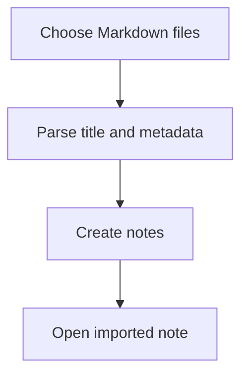

# Markdown Full Syntax Import Test

This file is designed to test as many Markdown features as possible after importing into D-NOTE.

The importer should use the frontmatter `title` as the note title, remove this frontmatter from the body, and keep the rest as Markdown content.

---

## Headings

# H1 Heading

## H2 Heading

### H3 Heading

#### H4 Heading

##### H5 Heading

###### H6 Heading

---

## Inline Text Styles

Plain text with **bold**, *italic*, ***bold italic***, ~~strikethrough~~, `inline code`, and a [normal link](https://example.com).

Autolink test: <https://example.com/autolink>

Email autolink test: <hello@example.com>

Escaped characters test: \*not italic\*, \`not code\`, and \[not a link\].

Line break test: this line ends with two spaces.  
This sentence should appear on the next line.

---

## Paragraphs

This is the first paragraph. It contains enough text to check wrapping, spacing, and normal reading rhythm in the imported note.

This is the second paragraph. It should remain separate from the first paragraph after import.

---

## Blockquotes

> This is a blockquote.
>
> It has multiple paragraphs.
>
> > This is a nested blockquote.

---

## Unordered Lists

- First unordered item
- Second unordered item
  - Nested unordered item
  - Another nested unordered item
- Third unordered item with **bold text**

---

## Ordered Lists

1. First ordered item
2. Second ordered item
   1. Nested ordered item
   2. Another nested ordered item
3. Third ordered item with `inline code`

---

## Task Lists

- [x] Completed task
- [ ] Open task
- [ ] Task with **bold** and `inline code`

---

## Tables

| Left aligned | Center aligned | Right aligned |
| :--- | :---: | ---: |
| Alpha | Beta | 100 |
| **Bold** | `Code` | 200 |
| Long cell content | This cell checks wrapping behavior | 300 |

---

## Code Blocks

```ts
type MarkdownCase = {
  title: string;
  imported: boolean;
  tags: string[];
};

const sample: MarkdownCase = {
  title: "Markdown Full Syntax Import Test",
  imported: true,
  tags: ["import", "markdown", "syntax"],
};
```

```json
{
  "title": "Markdown Full Syntax Import Test",
  "status": "Draft",
  "type": "markdown"
}
```

```bash
pnpm -C client exec tsc -b
pnpm -C client build
```

---

## Mermaid Code Block



---

## Images


---

## Horizontal Rules

Text before a horizontal rule.

---

Text after a horizontal rule.

***

Text after an asterisk rule.

___

Text after an underscore rule.

---

## HTML Inline And Block

Inline HTML test: <kbd>Ctrl</kbd> + <kbd>K</kbd>

<details>
<summary>HTML details block</summary>

This content is inside an HTML details element.

</details>

---

## Footnotes And References

Here is a sentence with a footnote reference.[^note]

Here is a reference-style link to [Example][example-link].

[^note]: This is the footnote body.

[example-link]: https://example.com/reference-link

---

## Definition List Style

Term
: Definition text. Some parsers support this as a definition list; others keep it as plain text.

---

## Math-Like Text

Inline math-like text: $E = mc^2$

Block math-like text:

$$
\int_0^1 x^2 dx = \frac{1}{3}
$$

---

## Final Checklist

- Title extracted from frontmatter
- Frontmatter removed from note body
- Headings render
- Inline styles render
- Links render
- Lists render
- Task list syntax is preserved or rendered
- Tables render
- Code blocks render
- Images render or preserve source
- HTML, footnotes, and math are preserved even if not specially rendered

